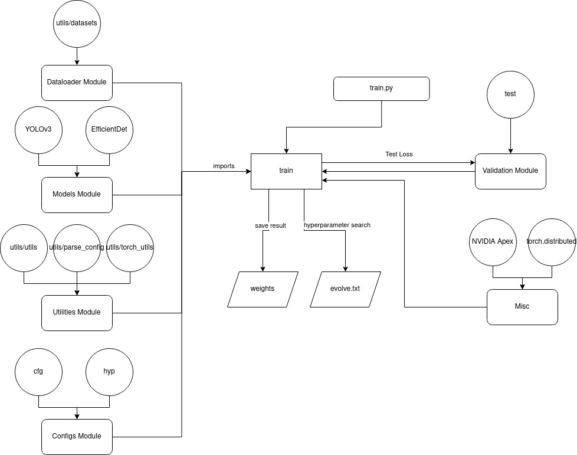
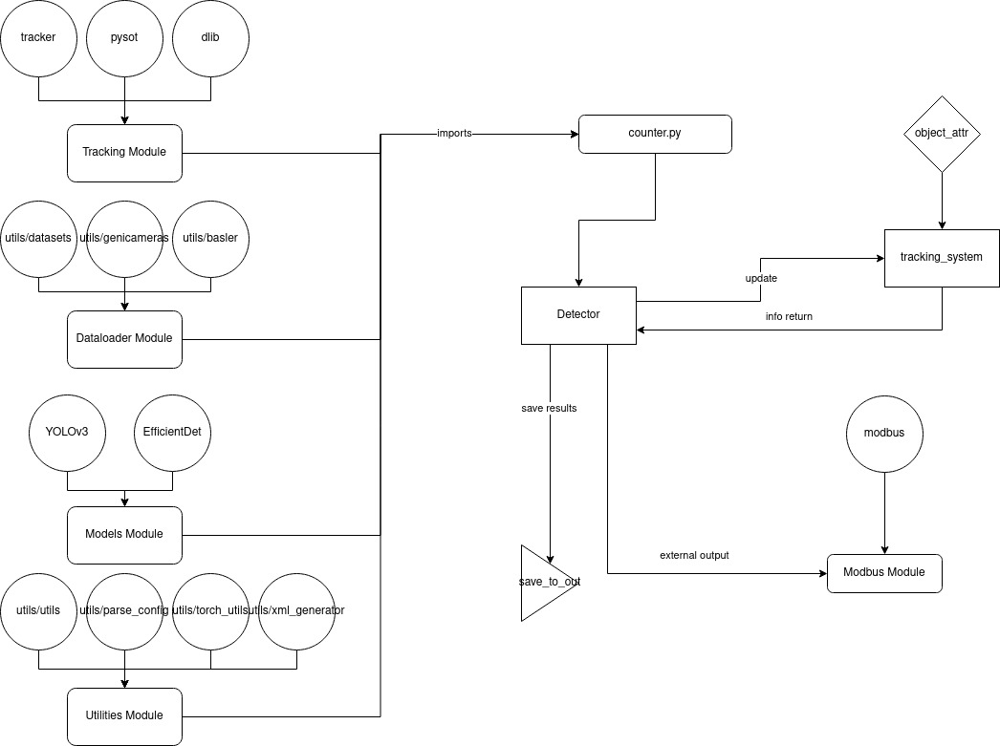

# Foodbox Counter
## Setup 
### Downloading Weights
Download weights files from the following links  
```
curl -L https://www.dropbox.com/sh/fo1nteiajps64wf/AAC8pQcSKRIvwY06UJ3MuyBHa?dl=1 > tracker.zip
unzip -d tracker tracker.zip
```
```
curl -L https://www.dropbox.com/sh/vpt9l0mcxs6iy3c/AADG59WBuNR6hDK3UK0LgZNIa?dl=0 > weights.zip
unzip -d weights weights.zip
```
#### OneDrive links
`https://cpfito365.sharepoint.com/:f:/r/sites/CPFROBOTICS/Shared%20Documents/weights?csf=1&web=1&e=Sb0sJp`
`https://cpfito365.sharepoint.com/:f:/r/sites/CPFROBOTICS/Shared%20Documents/tracker?csf=1&web=1&e=mHQvvU`

### Docker
```
./docker/cloud_run.sh
cd /workspace/home/${PATH_TO_PROJECT_IN_HOME_DIRECTORY}
```
### Manual Installation
```
pip3 install docker/requirements.txt
```
Install the binaries in the docker folder and install OpenCV.  

## Operation
### Training

#### Dataset creation
Annotate in PASCAL VOC format for EfficientDet and YOLOv3 or annotate in YOLO format for YOLOv3 (e.g. labelImg: https://github.com/tzutalin/labelImg)  
##### YOLOv3
After annotation, run `proportion.py` and `rename.py` on dataset folder.  
Make the corresponding configuration files in folder as follows,  
@${DATASET_NAME / ANY_NAME}.names  
```
NAMES_OF_CLASSES\n
......
```
@${DATASET_NAME / ANY_NAME}.data  
```
classes=${NUMBER_OF_CLASSES}
train=${PATH_TO_DATASET_TRAIN_FOLDER}
valid=${PATH_TO_DATASET_VALIDATION_FOLDER}
names=${PATH_TO_NAMES_FILE}
backup=backup/
eval=${DATASET_NAME}
```
Examples of  are included in the `data` folder.  
##### Efficientdet
Currently broken, necessary files is in the `efficientdet` folder.  
#### Examples of Usage
```
python train.py \
    --batch-size 4 \
    --accumulate 4 \
    --data data/nongjok.data \
    --multi-scale \
    --cache-images \
    --weights '' \
    --name nongjok2
```
```
python train.py \
    --cfg cfg/yolov3-spp-1cls.cfg \
    --data data/egg_tray2.data \
    --name egg_tray_precision3 \
    --batch-size 13 \
    --weights '' \
    --epoch 1500
```
### Inference 

#### Configs
 @`${PROJECT_PATH}/stream.txt`
```
{START}-{END} {SOURCE}\n
.........
```
`{START}` Start of Modbus client ID range  
`{END}` End of Modbus client ID range  
`{SOURCE}` Images source, accepts RTSP, HTTP, V4L2 cameras, Basler cameras, any camera supported by the GenICam standard and multiple streams in text file format.  
 Input format with header {'rtsp', 'http', 'basler', 'geni'}, respectively  
 @`${PROJECT_PATH}/counter.py`  
 `--cfg` change default=${CONFIG_MODEL_IS_TRAINED_WITH}  
 `--weights` change default=${WEIGHTS_PATH}  
 `--data` change default=${PATH_TO_DATASET.DATA_FILE}  
 `--view-img` if you would like to disable change default='store_true'  
 
#### Examples of Usage
Additional argparse options are included in `main.py`. The main script with default settings can be run as:  
```
python main.py
```
Labels generator with YOLOv3 weights  
```
python counter.py \
    --cfg cfg/yolov3-spp.cfg \
    --source /workspace/home/save_video/ \
    --data data/nongjok.data \
    --conf-thres 0.1 \ 
    --weights weights/bestnongjok2.pt \
    --save-labels \
    --view
```
